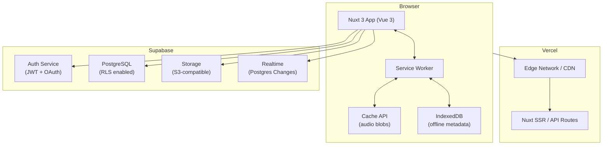

# Design Document: Supabase Web Platform

## Overview

This document describes the technical design for migrating the Audiobookshelf client from a Nuxt 2 + Capacitor app (connecting to a self-hosted server) to a fully web-native application. The new platform is deployed on Vercel, uses Nuxt 3 (Vue 3) for the frontend, and Supabase for all backend services (Auth, PostgreSQL with RLS, Storage, and Realtime).

### Goals

- Replace the self-hosted server dependency with Supabase-managed infrastructure.
- Deliver a PWA-capable web app installable from the browser with offline playback via Service Worker + Cache API / IndexedDB.
- Preserve the core user experience: library management, audio streaming, ebook reading, progress sync, playlists, and collections.
- Defer native mobile builds (Capacitor/Android/iOS) and Apple OAuth to a future phase.

### Key Design Decisions

| Decision           | Choice                                        | Rationale                                                                        |
| ------------------ | --------------------------------------------- | -------------------------------------------------------------------------------- |
| Frontend framework | Nuxt 3 (Vue 3)                                | Incremental migration path from Nuxt 2; SSR/SSG flexibility for Vercel           |
| Backend            | Supabase                                      | Managed Postgres + Auth + Storage + Realtime in one platform                     |
| Deployment         | Vercel                                        | Zero-config Nuxt 3 support; edge network for fast global delivery                |
| Offline storage    | Cache API (audio) + IndexedDB (metadata)      | Cache API is best for large binary blobs; IndexedDB for structured offline state |
| Auth               | Supabase Auth (email/password + Google OAuth) | Built-in JWT refresh, RLS integration, OAuth providers                           |
| Real-time sync     | Supabase Realtime (Postgres Changes)          | Native integration with the database; no separate WebSocket server needed        |

---

## Architecture

### High-Level System Diagram



### Request Flow

1. User navigates to the Vercel URL → Nuxt 3 serves the initial HTML (SSR or static).
2. The Supabase JS client (`@supabase/supabase-js`) is initialized in the browser with the public anon key.
3. All database reads/writes go directly from the browser to Supabase via the PostgREST API, authenticated with the user's JWT.
4. Media files are fetched from Supabase Storage via signed URLs (1-hour TTL).
5. The Service Worker intercepts fetch requests for media URLs and serves from Cache API when offline.
6. Realtime subscriptions are established over WebSocket directly to Supabase Realtime.

### Nuxt 3 Module Structure

```
/
├── app.vue                    # Root layout
├── nuxt.config.ts             # Nuxt 3 config (PWA, Vercel preset)
├── pages/
│   ├── index.vue              # Library home
│   ├── login.vue              # Auth page
│   ├── item/[id].vue          # Library item detail
│   ├── player.vue             # Full-screen player
│   └── reader/[id].vue        # Ebook reader
├── components/
│   ├── player/                # AudioPlayer, SleepTimer, ChapterList
│   ├── reader/                # EpubReader, PdfReader, MobiReader, ComicReader
│   ├── library/               # BookCard, BookshelfGrid, FilterBar
│   └── download/              # DownloadManager, DownloadProgress
├── composables/
│   ├── useAuth.ts             # Auth state + session management
│   ├── usePlayer.ts           # Playback engine wrapper
│   ├── useProgress.ts         # Progress upsert + Realtime subscription
│   ├── useDownload.ts         # Download orchestration
│   └── usePreferences.ts      # User preferences
├── server/
│   └── api/                   # Nuxt server routes (thin proxies if needed)
├── plugins/
│   ├── supabase.client.ts     # Supabase client initialization
│   └── pwa.client.ts          # Service Worker registration
├── public/
│   ├── manifest.webmanifest   # PWA manifest
│   └── sw.js                  # Service Worker (built by Workbox or custom)
└── stores/
    ├── auth.ts                # Pinia: session + user
    ├── library.ts             # Pinia: libraries + items
    ├── player.ts              # Pinia: playback state
    └── downloads.ts           # Pinia: download state
```

---

## Components and Interfaces

### Auth Service (`composables/useAuth.ts`)

Wraps `@supabase/supabase-js` auth methods. Exposes:

```typescript
interface UseAuth {
  user: Ref<User | null>
  session: Ref<Session | null>
  signInWithEmail(email: string, password: string): Promise<AuthResult>
  signUpWithEmail(email: string, password: string): Promise<AuthResult>
  signInWithGoogle(): Promise<void>
  signOut(): Promise<void>
  refreshSession(): Promise<Session | null>
}
```

Session persistence is handled by the Supabase client's built-in `localStorage` adapter. The `onAuthStateChange` listener drives the Pinia `auth` store and triggers a redirect to `/login` when the session is cleared.

### Player (`composables/usePlayer.ts` + `components/player/AudioPlayer.vue`)

The Player wraps the browser's native `HTMLAudioElement`. It does **not** use the Capacitor `AbsAudioPlayer` plugin (which is deferred to the native phase).

```typescript
interface UsePlayer {
  // State
  currentItem: Ref<LibraryItem | null>
  currentTime: Ref<number>
  duration: Ref<number>
  isPlaying: Ref<boolean>
  playbackRate: Ref<number>
  chapters: Ref<Chapter[]>
  currentChapter: Ref<Chapter | null>

  // Controls
  load(item: LibraryItem, startTime?: number): Promise<void>
  play(): void
  pause(): void
  seek(time: number): void
  setPlaybackRate(rate: number): void
  jumpForward(seconds: number): void
  jumpBackward(seconds: number): void
  setSleepTimer(minutes: number | 'chapter_end'): void
  cancelSleepTimer(): void

  // Media Session API
  updateMediaSession(): void
}
```

Multi-track audiobooks are handled by maintaining a track queue. When a track's `ended` event fires, the player advances to the next track's signed URL and calls `load()` on the `HTMLAudioElement`.

Progress is reported to `useProgress` every time `currentTime` changes by ≥ 10 seconds (debounced).

### Ebook Reader (`components/reader/`)

| Format  | Library                                 | Notes                                                                   |
| ------- | --------------------------------------- | ----------------------------------------------------------------------- |
| EPUB    | `epubjs` (0.3.x)                        | Existing integration; adapt `requestMethod` to use Supabase signed URLs |
| PDF     | `@teckel/vue-pdf`                       | Existing integration                                                    |
| MOBI    | Custom parser (`assets/ebooks/mobi.js`) | Existing integration                                                    |
| CBZ/CBR | `libarchive.js`                         | Existing integration                                                    |

The reader composable (`useEbookProgress.ts`) upserts `media_progress` records with `ebook_location` (CFI for EPUB, page number for PDF) and `ebook_progress` (0–1 float).

### Download Manager (`composables/useDownload.ts`)

```typescript
interface UseDownload {
  downloads: Ref<Map<string, DownloadState>>
  startDownload(item: LibraryItem): Promise<void>
  pauseDownload(itemId: string): void
  resumeDownload(itemId: string): Promise<void>
  deleteDownload(itemId: string): Promise<void>
  getStorageUsage(): Promise<StorageUsage>
  isDownloaded(itemId: string): boolean
}

interface DownloadState {
  itemId: string
  status: 'pending' | 'downloading' | 'complete' | 'error'
  bytesDownloaded: number
  totalBytes: number
  retryCount: number
}
```

Files are fetched via `fetch()` with a `ReadableStream` to track byte progress. Audio blobs are stored in the Cache API under a cache named `abs-audio-v1`, keyed by `user_id/item_id/filename`. Metadata (download state, item info) is stored in IndexedDB (`abs-offline-db`).

### Service Worker (`public/sw.js`)

Built with Workbox (via `@vite-pwa/nuxt`). Strategy:

- **App shell** (HTML, JS, CSS): `StaleWhileRevalidate`
- **Cover images**: `CacheFirst` with 30-day expiry
- **Audio files** (Supabase Storage URLs): Custom `NetworkFirst` handler that falls back to Cache API entries keyed by `user_id/item_id/filename`

The Service Worker does **not** store signed URLs directly (they expire). Instead, it stores the raw audio blob under a stable cache key and intercepts requests to Supabase Storage by matching the path pattern.

### Realtime Progress Sync (`composables/useProgress.ts`)

```typescript
interface UseProgress {
  subscribeToProgress(userId: string): RealtimeChannel
  upsertProgress(itemId: string, progress: ProgressPayload): Promise<void>
  fetchAllProgress(): Promise<MediaProgress[]>
}
```

The Supabase Realtime channel subscribes to `postgres_changes` on the `media_progress` table filtered by `user_id = auth.uid()`. On receiving a change event, the player store is updated if the changed item is currently playing.

---

## Data Models

### Database Schema

All tables use `uuid` primary keys generated by `gen_random_uuid()`. All timestamps are `timestamptz` defaulting to `now()`.

#### `libraries`

```sql
CREATE TABLE libraries (
  id            uuid PRIMARY KEY DEFAULT gen_random_uuid(),
  owner_user_id uuid NOT NULL REFERENCES auth.users(id) ON DELETE CASCADE,
  name          text NOT NULL,
  media_type    text NOT NULL CHECK (media_type IN ('audiobook', 'podcast')),
  created_at    timestamptz NOT NULL DEFAULT now(),
  updated_at    timestamptz NOT NULL DEFAULT now()
);
```

#### `library_items`

```sql
CREATE TABLE library_items (
  id               uuid PRIMARY KEY DEFAULT gen_random_uuid(),
  library_id       uuid NOT NULL REFERENCES libraries(id) ON DELETE CASCADE,
  title            text NOT NULL,
  author           text,
  narrator         text,
  series           text,
  series_sequence  text,
  genres           text[] DEFAULT '{}',
  tags             text[] DEFAULT '{}',
  description      text,
  cover_image_path text,
  duration_seconds numeric,
  published_year   int,
  added_at         timestamptz NOT NULL DEFAULT now(),
  updated_at       timestamptz NOT NULL DEFAULT now()
);

CREATE INDEX library_items_library_id_idx ON library_items(library_id);
CREATE INDEX library_items_title_idx ON library_items USING gin(to_tsvector('english', title));
```

#### `media_files`

```sql
CREATE TABLE media_files (
  id             uuid PRIMARY KEY DEFAULT gen_random_uuid(),
  library_item_id uuid NOT NULL REFERENCES library_items(id) ON DELETE CASCADE,
  storage_path   text NOT NULL,
  filename       text NOT NULL,
  mime_type      text NOT NULL,
  size_bytes     bigint,
  track_index    int DEFAULT 0,
  duration_seconds numeric,
  created_at     timestamptz NOT NULL DEFAULT now()
);
```

#### `media_progress`

```sql
CREATE TABLE media_progress (
  id               uuid PRIMARY KEY DEFAULT gen_random_uuid(),
  user_id          uuid NOT NULL REFERENCES auth.users(id) ON DELETE CASCADE,
  library_item_id  uuid NOT NULL REFERENCES library_items(id) ON DELETE CASCADE,
  episode_id       uuid,
  current_time     numeric NOT NULL DEFAULT 0,
  duration         numeric,
  progress         numeric NOT NULL DEFAULT 0 CHECK (progress >= 0 AND progress <= 1),
  is_finished      boolean NOT NULL DEFAULT false,
  ebook_location   text,
  ebook_progress   numeric CHECK (ebook_progress >= 0 AND ebook_progress <= 1),
  last_update      timestamptz NOT NULL DEFAULT now(),
  UNIQUE (user_id, library_item_id, episode_id)
);

CREATE INDEX media_progress_user_id_idx ON media_progress(user_id);
```

#### `bookmarks`

```sql
CREATE TABLE bookmarks (
  id               uuid PRIMARY KEY DEFAULT gen_random_uuid(),
  user_id          uuid NOT NULL REFERENCES auth.users(id) ON DELETE CASCADE,
  library_item_id  uuid NOT NULL REFERENCES library_items(id) ON DELETE CASCADE,
  time_seconds     numeric NOT NULL,
  title            text,
  created_at       timestamptz NOT NULL DEFAULT now()
);
```

#### `playlists`

```sql
CREATE TABLE playlists (
  id          uuid PRIMARY KEY DEFAULT gen_random_uuid(),
  user_id     uuid NOT NULL REFERENCES auth.users(id) ON DELETE CASCADE,
  name        text NOT NULL,
  description text,
  created_at  timestamptz NOT NULL DEFAULT now(),
  updated_at  timestamptz NOT NULL DEFAULT now()
);

CREATE TABLE playlist_items (
  id               uuid PRIMARY KEY DEFAULT gen_random_uuid(),
  playlist_id      uuid NOT NULL REFERENCES playlists(id) ON DELETE CASCADE,
  library_item_id  uuid NOT NULL REFERENCES library_items(id) ON DELETE CASCADE,
  episode_id       uuid,
  sort_order       int NOT NULL DEFAULT 0
);

CREATE INDEX playlist_items_playlist_id_idx ON playlist_items(playlist_id, sort_order);
```

#### `collections`

```sql
CREATE TABLE collections (
  id          uuid PRIMARY KEY DEFAULT gen_random_uuid(),
  library_id  uuid NOT NULL REFERENCES libraries(id) ON DELETE CASCADE,
  user_id     uuid NOT NULL REFERENCES auth.users(id) ON DELETE CASCADE,
  name        text NOT NULL,
  created_at  timestamptz NOT NULL DEFAULT now(),
  updated_at  timestamptz NOT NULL DEFAULT now()
);

CREATE TABLE collection_books (
  collection_id    uuid NOT NULL REFERENCES collections(id) ON DELETE CASCADE,
  library_item_id  uuid NOT NULL REFERENCES library_items(id) ON DELETE CASCADE,
  PRIMARY KEY (collection_id, library_item_id)
);
```

#### `user_preferences`

```sql
CREATE TABLE user_preferences (
  user_id               uuid PRIMARY KEY REFERENCES auth.users(id) ON DELETE CASCADE,
  playback_rate         numeric NOT NULL DEFAULT 1.0,
  jump_forward_seconds  int NOT NULL DEFAULT 30,
  jump_backward_seconds int NOT NULL DEFAULT 10,
  theme                 text NOT NULL DEFAULT 'system' CHECK (theme IN ('light', 'dark', 'system')),
  order_by              text NOT NULL DEFAULT 'added_at',
  order_desc            boolean NOT NULL DEFAULT true,
  filter_by             text,
  collapse_series       boolean NOT NULL DEFAULT false,
  updated_at            timestamptz NOT NULL DEFAULT now()
);
```

### RLS Policies

All tables have RLS enabled. The pattern is consistent: users can only read, insert, update, and delete their own rows.

```sql
-- Example: libraries table (same pattern applies to all user-owned tables)
ALTER TABLE libraries ENABLE ROW LEVEL SECURITY;

CREATE POLICY "Users can read own libraries"
  ON libraries FOR SELECT
  USING (owner_user_id = auth.uid());

CREATE POLICY "Users can insert own libraries"
  ON libraries FOR INSERT
  WITH CHECK (owner_user_id = auth.uid());

CREATE POLICY "Users can update own libraries"
  ON libraries FOR UPDATE
  USING (owner_user_id = auth.uid());

CREATE POLICY "Users can delete own libraries"
  ON libraries FOR DELETE
  USING (owner_user_id = auth.uid());

-- library_items: access via library ownership
ALTER TABLE library_items ENABLE ROW LEVEL SECURITY;

CREATE POLICY "Users can access items in own libraries"
  ON library_items FOR ALL
  USING (
    library_id IN (
      SELECT id FROM libraries WHERE owner_user_id = auth.uid()
    )
  );
```

The same ownership-chain pattern applies to `media_files`, `bookmarks`, `playlist_items`, `collection_books`. Direct user-id tables (`media_progress`, `playlists`, `collections`, `user_preferences`) use `user_id = auth.uid()`.

### Supabase Storage Bucket Structure

```
Bucket: media (private, RLS enforced)
  {user_id}/
    {library_item_id}/
      audio/
        {filename}.mp3
        {filename}.m4b
      ebook/
        {filename}.epub
        {filename}.pdf
      cover/
        cover.jpg

Bucket: covers (public, read-only for all)
  {user_id}/
    {library_item_id}/
      cover.jpg
```

Storage RLS policies restrict all operations to the authenticated user's own path prefix (`{user_id}/**`). Signed URLs for audio/ebook files are generated server-side with a 1-hour TTL via `supabase.storage.from('media').createSignedUrl(path, 3600)`.

---

## Correctness Properties

_A property is a characteristic or behavior that should hold true across all valid executions of a system — essentially, a formal statement about what the system should do. Properties serve as the bridge between human-readable specifications and machine-verifiable correctness guarantees._

### Property 1: Progress upsert round-trip

_For any_ valid `(user_id, library_item_id, current_time, progress)` tuple where `0 ≤ progress ≤ 1` and `0 ≤ current_time ≤ duration`, upserting a `media_progress` record and then fetching it back SHALL return a record with identical `current_time`, `progress`, and `is_finished` values.

**Validates: Requirements 6.1, 6.4**

---

### Property 2: RLS isolation — no cross-user data leakage

_For any_ two distinct authenticated users A and B, any read query (libraries, library_items, media_progress, bookmarks, playlists, collections, media_files) executed under user A's JWT SHALL never return rows that belong to user B, and any write or delete operation by user A targeting user B's rows SHALL be rejected.

**Validates: Requirements 2.3, 2.6, 3.2, 4.8**

---

### Property 3: Cascade delete completeness

_For any_ library or library_item that is deleted, all descendant rows in `library_items`, `media_files`, `media_progress`, `bookmarks`, `playlist_items`, and `collection_books` that reference the deleted entity SHALL also be absent from the database after the delete completes.

**Validates: Requirements 2.5, 3.7, 4.7**

---

### Property 4: Playlist item ordering preserved

_For any_ playlist and any permutation of its items, after persisting a reorder operation, fetching the playlist items ordered by `sort_order` SHALL return the items in the same permuted sequence.

**Validates: Requirements 8.4**

---

### Property 5: Storage path and cache key user scoping

_For any_ media file uploaded or downloaded under user A's session, the storage path and Cache API key SHALL begin with user A's `user_id` prefix, and a lookup using user B's prefix SHALL return no results.

**Validates: Requirements 4.4, 11.9**

---

### Property 6: Downloaded items served from cache regardless of connectivity

_For any_ Library_Item that has been fully downloaded to Browser_Storage, initiating playback — whether the browser is online or offline — SHALL result in audio data being served from the Cache API, and no fetch requests SHALL be made to Supabase Storage URLs for that item.

**Validates: Requirements 11.5, 11.6**

---

### Property 7: Progress value invariant

_For any_ `media_progress` record, the `progress` field SHALL always satisfy `0 ≤ progress ≤ 1`, and `current_time` SHALL always satisfy `0 ≤ current_time ≤ duration` when `duration` is non-null.

**Validates: Requirements 6.1**

---

### Property 8: File type validation

_For any_ file upload attempt, the application validation layer SHALL accept the file if and only if its MIME type is in the allowed set for its category (audio: MP3/M4A/M4B/OGG/FLAC/AAC; ebook: EPUB/PDF/MOBI/CBZ/CBR; cover: JPEG/PNG/WebP ≤ 10 MB), and SHALL reject all other types before making a Storage_Service request.

**Validates: Requirements 4.1, 4.2, 4.3**

---

### Property 9: Upload retry behavior

_For any_ file upload that fails with a network error, the application SHALL retry the operation up to 3 times, with each retry delay being at least double the previous delay (exponential backoff), and SHALL present an error to the user only after all 3 retries are exhausted.

**Validates: Requirements 4.6**

---

### Property 10: Library item filter correctness

_For any_ set of library items and any combination of filter criteria (author, series, genre, tag, progress status), all items returned by the filtered query SHALL satisfy every specified filter predicate, and no item that fails any predicate SHALL appear in the results.

**Validates: Requirements 3.4**

---

### Property 11: Library item sort correctness

_For any_ set of library items and any sort field (title, author, added_at, duration_seconds, published_year) with any direction (asc/desc), the returned list SHALL be ordered such that for every adjacent pair of items, the sort key of the first item compares correctly to the sort key of the second item according to the specified direction.

**Validates: Requirements 3.5**

---

### Property 12: Playback progress 10-second threshold

_For any_ pair of playback positions `(old_time, new_time)`, the `useProgress` composable SHALL trigger an upsert to `media_progress` if and only if `|new_time − old_time| ≥ 10`.

**Validates: Requirements 6.1**

---

### Property 13: Ebook reading position round-trip

_For any_ ebook Library_Item and any reading position (CFI string for EPUB, page number for PDF), saving the position and then reopening the item SHALL result in the reader initializing at the saved position.

**Validates: Requirements 7.5, 7.6**

---

### Property 14: Download progress percentage accuracy

_For any_ download in progress with `bytesDownloaded` bytes transferred out of `totalBytes`, the displayed progress percentage SHALL equal `floor(bytesDownloaded / totalBytes * 100)`.

**Validates: Requirements 11.2**

---

### Property 15: Download deletion clears cache

_For any_ Library_Item that has been fully downloaded, after the user deletes the download, the Cache API SHALL contain no entries whose key matches the item's storage path prefix, and `isDownloaded(itemId)` SHALL return false.

**Validates: Requirements 11.7**

---

## Error Handling

### Authentication Errors

| Scenario                      | Handling                                                             |
| ----------------------------- | -------------------------------------------------------------------- |
| Invalid credentials           | Display generic "Invalid email or password" message (no enumeration) |
| JWT expired                   | Supabase client auto-refreshes; transparent to the user              |
| Refresh token invalid/expired | Clear session, redirect to `/login`, show toast                      |
| Email not verified            | Show "Please verify your email" banner; block library access         |
| Network error during auth     | Show retry prompt; do not clear existing session                     |

### Storage Errors

| Scenario                 | Handling                                                                                |
| ------------------------ | --------------------------------------------------------------------------------------- |
| Upload failure           | Retry up to 3× with exponential backoff (1s, 2s, 4s); show error toast on final failure |
| Signed URL fetch failure | Retry once; if still failing, show "Unable to load media" error                         |
| Storage quota exceeded   | Show "Storage quota exceeded" dialog; suggest deleting downloads                        |

### Realtime Errors

| Scenario             | Handling                                                                 |
| -------------------- | ------------------------------------------------------------------------ |
| WebSocket disconnect | Supabase client reconnects automatically; progress updates queue locally |
| Missed update        | On reconnect, fetch latest `media_progress` from DB to reconcile         |

### Offline / Download Errors

| Scenario                   | Handling                                                               |
| -------------------------- | ---------------------------------------------------------------------- |
| Download interrupted       | Resume from last byte on reconnect (up to 3 retries)                   |
| Cache API unavailable      | Fall back to IndexedDB blob storage; if neither available, inform user |
| Insufficient browser quota | Show storage usage dialog; prompt user to delete downloads             |

### Database Errors

| Scenario             | Handling                                                              |
| -------------------- | --------------------------------------------------------------------- |
| RLS violation (403)  | Log error; show "Access denied" toast; do not expose internal details |
| Constraint violation | Map to user-friendly validation messages                              |
| Network timeout      | Retry idempotent reads once; show error for writes                    |

---

## Testing Strategy

### Unit Tests (Vitest)

Focus on pure logic layers:

- `useProgress`: upsert debouncing, 10-second threshold logic, progress value clamping
- `useDownload`: retry logic, byte-range tracking, storage key generation
- `usePlayer`: track queue advancement, sleep timer countdown, playback rate application
- `useAuth`: session persistence, redirect logic on token expiry
- Validation helpers: title whitespace rejection, file type acceptance lists, progress range checks

Avoid writing unit tests for Supabase SDK internals or browser API behavior — those are covered by integration tests.

### Property-Based Tests (fast-check, minimum 100 iterations each)

Each property test references its design property by tag comment: `// Feature: supabase-web-platform, Property N: <property_text>`

- **Property 1** — Generate random `(current_time, progress)` pairs within valid ranges; upsert then fetch; assert round-trip equality.
- **Property 2** — Generate random user pairs and library/item data; assert RLS queries never leak cross-user data (tested against a local Supabase instance or mock).
- **Property 3** — Generate random item/library trees with associated progress/bookmarks/playlist entries; delete root; assert all descendants are absent.
- **Property 4** — Generate random playlists with random item orderings; persist reorder; fetch and assert sequence matches.
- **Property 5** — Generate random user IDs and file paths; assert storage key lookup for user B never returns user A's files.
- **Property 6** — Download item; simulate online/offline states; play; assert all audio requests are served from cache.
- **Property 7** — Generate random `(current_time, duration, progress)` values; assert DB constraint rejects out-of-range values.
- **Property 8** — Generate random files with valid/invalid MIME types and sizes; assert validation accepts/rejects correctly.
- **Property 9** — Mock network failures; assert retry is attempted exactly 3 times with exponential backoff delays.
- **Property 10** — Generate random item sets with random metadata; apply random filter combinations; assert all returned items satisfy every predicate.
- **Property 11** — Generate random item sets; apply random sort field and direction; assert returned list is correctly ordered.
- **Property 12** — Generate random `(old_time, new_time)` pairs; assert upsert is triggered iff `|new_time − old_time| ≥ 10`.
- **Property 13** — Generate random ebook locations; save; reopen; assert reader initializes at saved location.
- **Property 14** — Generate random `(bytesDownloaded, totalBytes)` pairs; assert displayed percentage equals `floor(ratio * 100)`.
- **Property 15** — Download item; delete download; assert Cache API has no entries for that item's path prefix.

### Integration Tests

Run against a local Supabase instance (`supabase start`):

- Full auth flow: sign-up → email verify → sign-in → JWT refresh → sign-out
- Library CRUD with RLS: create library as user A; attempt read as user B; assert 0 rows returned
- Cascade deletes: create library → items → progress → delete library; assert all child rows gone
- Storage upload/download: upload audio file; generate signed URL; fetch and assert content matches
- Realtime: open two sessions; update progress in session 1; assert session 2 receives the change within 2 seconds

### PWA / Service Worker Tests

- Offline playback: download item; go offline (DevTools); play item; assert no network requests to Supabase Storage
- Cache key scoping: download as user A; simulate user B session; assert cache lookup returns nothing

### End-to-End Tests (Playwright)

- Login flow (email/password and Google OAuth mock)
- Library creation and item upload
- Audio playback with progress persistence
- Ebook reading with position restore
- Download, go offline, play from cache

### Vercel Deployment Configuration

```typescript
// nuxt.config.ts (relevant sections)
export default defineNuxtConfig({
  // Use 'vercel' (Node.js runtime) rather than 'vercel-edge' because
  // @nuxtjs/supabase relies on Node.js APIs (cookies, headers) that are
  // not available in the Vercel Edge Runtime.
  nitro: {
    preset: 'vercel'
  },
  supabase: {
    url: process.env.NUXT_PUBLIC_SUPABASE_URL,
    key: process.env.NUXT_PUBLIC_SUPABASE_ANON_KEY,
    redirectOptions: {
      login: '/login',
      callback: '/confirm',
      // Exclude /login and /confirm from auth redirects so the OAuth
      // callback page can establish the session before being redirected.
      exclude: ['/login', '/confirm']
    }
  },
  runtimeConfig: {
    // Private key — server-side only, not required for initial deployment
    supabaseServiceKey: '',
    public: {
      supabaseUrl: process.env.NUXT_PUBLIC_SUPABASE_URL ?? '',
      supabaseAnonKey: process.env.NUXT_PUBLIC_SUPABASE_ANON_KEY ?? ''
    }
  }
})
```

**Vercel environment variables required:**

| Variable                        | Description                                                       |
| ------------------------------- | ----------------------------------------------------------------- |
| `NUXT_PUBLIC_SUPABASE_URL`      | Supabase project URL (exposed to browser via Nuxt runtime config) |
| `NUXT_PUBLIC_SUPABASE_ANON_KEY` | Supabase public anon key (exposed to browser)                     |
| `SUPABASE_SERVICE_KEY`          | Optional — server-side only, not required for initial deployment  |

**`vercel.json`:**

```json
{
  "buildCommand": "nuxt build",
  "outputDirectory": ".output/public",
  "framework": null,
  "headers": [
    {
      "source": "/sw.js",
      "headers": [
        { "key": "Cache-Control", "value": "no-cache" },
        { "key": "Service-Worker-Allowed", "value": "/" }
      ]
    },
    {
      "source": "/manifest.webmanifest",
      "headers": [
        { "key": "Cache-Control", "value": "no-cache" },
        { "key": "Content-Type", "value": "application/manifest+json" }
      ]
    }
  ]
}
```

The Service Worker must be served with `Cache-Control: no-cache` so browsers always check for updates. The `Service-Worker-Allowed: /` header grants the SW scope over the entire origin.

**Supabase Authentication URL Configuration:**

In the Supabase dashboard under Authentication → URL Configuration, the following must be set for Google OAuth to work correctly with the Vercel deployment:

- **Site URL**: the Vercel deployment URL (e.g. `https://your-app.vercel.app`)
- **Redirect URLs**: add `https://your-app.vercel.app/confirm` so the OAuth callback can establish the session before any redirect occurs
